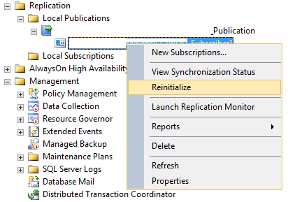
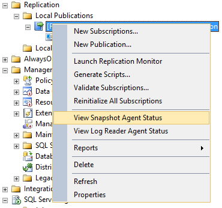
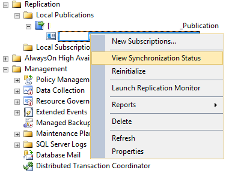

### Check Table Sizes
```sql
SELECT 
	 QUOTENAME(SCHEMA_NAME(sOBJ.schema_id)) + '.' + QUOTENAME(sOBJ.name) AS [Table Name]
	,SUM(sdmvPTNS.row_count) AS [Row Count]
	,FORMAT(id.last_user_update, 'yyyy-MM-dd HH:mm:ss') as [Last User Update]
FROM sys.objects AS sOBJ
INNER JOIN sys.dm_db_partition_stats AS sdmvPTNS ON sOBJ.object_id = sdmvPTNS.object_id
LEFT JOIN sys.dm_db_index_usage_stats id ON sOBJ.object_id = id.object_id
	AND id.index_id = sdmvPTNS.index_id
	AND id.database_id = DB_ID()
WHERE sOBJ.type = 'U'
	AND sOBJ.is_ms_shipped = 0x0
	AND sdmvPTNS.index_id < 2
GROUP BY sOBJ.schema_id
	,sOBJ.name
	,id.last_user_update
ORDER BY [Table Name]
GO
```

[Download .bat files](compare%20tables%20and%20rows%20count) to run and compare 2 databases automatically.

### Check Distribution Database:
```sql
-- Select distributions database
select d.*, p.*
from msdb.dbo.MSdistpublishers p
join msdb.dbo.MSdistributiondbs d on p.distribution_db = d.name

-- Use [distribution_db_name]
EXEC sp_helpfile;
EXEC sp_spaceused;

sp_spaceused [MSrepl_commands]
GO

select top 100 * 
from [MSrepl_commands]
GO
```

### Check Publication & Subscription
```sql
select distinct 
srv.srvname publication_server 
, a.publisher_db
, p.publication publication_name
, p.retention
, ss.srvname subscription_server
, s.subscriber_db
, da.subscriber_login
from MSArticles a 
join MSpublications p on a.publication_id = p.publication_id
join MSsubscriptions s on p.publication_id = s.publication_id
join master..sysservers ss on s.subscriber_id = ss.srvid
join master..sysservers srv on srv.srvid = p.publisher_id
join MSdistribution_agents da on da.publisher_id = p.publisher_id 
and da.subscriber_id = s.subscriber_id
ORDER BY p.retention 
```

### Check Distribution Clean Up Job:

> Executed as user: XXX. Could not remove directory 'C:\XXX\unc\XXX_PROD_PUBLICATION\20190801073125\'. Check the security context of xp_cmdshell and close other processes that may be accessing the directory.
[SQLSTATE 42000] (Error 20015)  ...
Could not clean up the distribution transaction tables. [SQLSTATE 01000] (Message 14152).  The step failed.

+ Reference these links:
  + [Distribution Cleanup failed due to security reasons](https://learnsql.wordpress.com/2012/10/15/distribution-cleanup-failed-due-to-security-reasons/)
  + [Distribution Agent fails with “Could not remove directory” error](https://repltalk.com/2011/01/02/distribution-agent-fails-with-could-not-remove-directory-error/)
  + [Distribution Cleanup Job And Xp_cmdshell](https://blog.pythian.com/distribution-cleanup-job-cant-delete-folder/)
+ If still struggling, remove the folder manually.
+ Check number of records: 
  > sp_spaceused [MSrepl_commands]
  + If the number is too big ( > 10.000.000 rows) we should jump to "Truncate [MSrepl_commands]" step.
  + Otherwise execute: 
  > EXEC dbo.sp_MSdistribution_cleanup @min_distretention = 0, @max_distretention = 72

### Check xp_cmdshell is enabled:
```sql
select * from sys.configurations
where name = 'xp_cmdshell'
GO
xp_cmdshell 'dir c:\'
GO
sp_configure 'show advanced options', '1'
RECONFIGURE
GO
sp_configure 'xp_cmdshell', '1' 
RECONFIGURE
GO
sp_configure 'xp_cmdshell', '0' 
RECONFIGURE
GO
```

### Truncate [MSrepl_commands]

[Process to truncate transaction log of replicated database](https://www.sqlservercentral.com/articles/process-to-truncate-transaction-log-of-replicated-database)

If see: "The initial snapshot for publication 'XYZ' is not yet available." should find and start the job: Snapshot Agent

### Troubleshooting Scenarios:
[The subscription(S) have been marked inactive and must be reinitialized.](https://www.msqlserver.net/2015/03/the-subscriptions-have-been-marked.html?m=1)

[Replication Max Text Length](https://www.sqlservercentral.com/blogs/replication-max-text-length)
> Error Description: Length of LOB data (65754) to be replicated exceeds configured maximum 65536. Use the stored procedure sp_configure to increase the configured maximum value for max text repl size option, which defaults to 65536. A configured value of -1 indicates no limit

[Configure the max text repl size Server Configuration Option](https://docs.microsoft.com/en-us/sql/database-engine/configure-windows/configure-the-max-text-repl-size-server-configuration-option?view=sql-server-2017)

# Move distribution database to another Drive:
```sql
-- Check the current location
SELECT name, physical_name AS CurrentLocation, state_desc  
FROM sys.master_files  
WHERE database_id = DB_ID(N'distribution');
GO

-- Check opening sessions to the database
SELECT DB_NAME(eS.database_id) AS [database_name]
	, eS.is_user_process
	, eS.session_id
	, eS.host_name
	, eS.program_name
	, es.login_name
	, es.original_login_name
	, es.open_transaction_count as total_open_transactions
	, ec.client_net_address
	, ec.client_tcp_port
	, ec.local_net_address
	, ec.local_tcp_port
	, count(ec.connection_id) as total_connections
FROM sys.dm_exec_sessions eS 
JOIN sys.dm_exec_connections eC on eC.session_id = es.session_id
WHERE DB_NAME(eS.database_id) = 'distribution'
GROUP BY DB_NAME(eS.database_id)
	, eS.is_user_process
	, eS.session_id
	, eS.host_name
	, eS.program_name
	, es.login_name
	, es.original_login_name
	, es.open_transaction_count
	, ec.client_net_address
	, ec.client_tcp_port
	, ec.local_net_address
	, ec.local_tcp_port
ORDER BY [database_name], is_user_process, session_id;

-- Set the database OFFLINE
-- You might need to stop SQL Server Agent before doing this
ALTER DATABASE distribution SET OFFLINE

-- Copy the data and log file of the distribution database to the new location.
ALTER DATABASE distribution MODIFY FILE ( NAME = distribution , FILENAME = 'E:\MSSQL\DATA\distribution.mdf')
ALTER DATABASE distribution MODIFY FILE ( NAME = distribution_log , FILENAME = 'E:\MSSQL\DATA\distribution.ldf')

-- Bring the database ONLINE
ALTER DATABASE distribution SET ONLINE
```

# Add new article to existing publication:
- [Add new article to existing publication for SQL Server Transactional Replication](https://www.mssqltips.com/sqlservertip/5704/add-new-article-to-existing-publication-for-sql-server-transactional-replication/)
- [Adding a new articles to a existing transactional replication without snapshot of entire articles](https://medium.com/geopits/adding-a-new-articles-to-a-existing-transactional-replication-without-snapshot-of-entire-articles-3d1af1d9b587)
```sql
select immediate_sync,allow_anonymous,* from distribution.dbo.MSpublications

EXEC sp_helpsubscription
GO

EXEC sp_changepublication
@publication = 'Publication Name',
@property = N'allow_anonymous',
@value = 'False'
GO
EXEC sp_changepublication
@publication = 'Publication Name',
@property = N'immediate_sync',
@value = 'False'
GO

```
- [Add article to transactional publication without generating new snapshot](https://dba.stackexchange.com/questions/12725/add-article-to-transactional-publication-without-generating-new-snapshot)
- [Limit snapshot size when adding new article to SQL Server replication](https://www.mssqltips.com/sqlservertip/2502/limit-snapshot-size-when-adding-new-article-to-sql-server-replication/)

# Reinitialize Subscription
- 
- 
- 