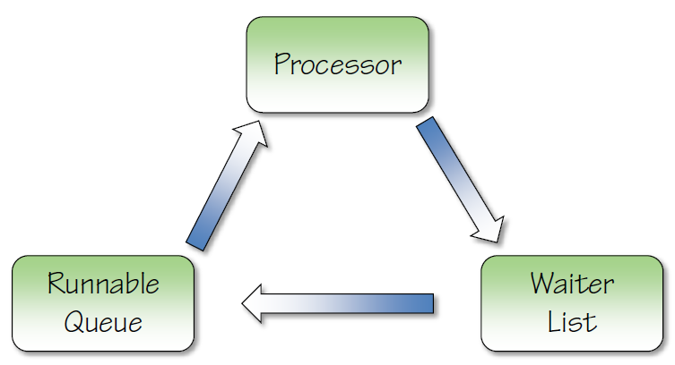
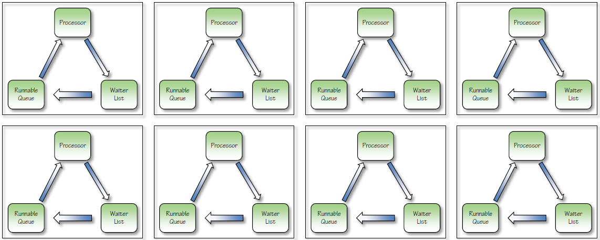
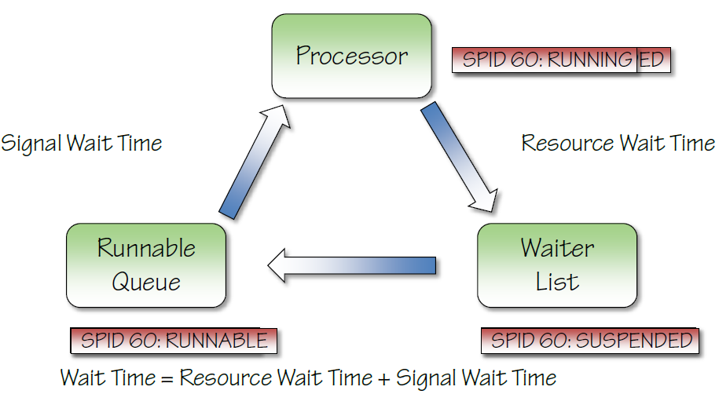

[SQL Server: Performance Troubleshooting Using Wait Statistics | Pluralsight](https://www.pluralsight.com/courses/sqlserver-waits)

## Thread Scheduling
- SQL Server performs its own thread scheduling 
  + Called non-preemptive scheduling 
  + More efficient (for SQL Server) than relying on Windows scheduling 
  + Performed by the SQLOS layer of the Storage Engine 
 
- Each processor core (whether logical or physical) has a scheduler 
  + A scheduler is responsible for managing the execution of work by threads 
  + Schedulers exist for user threads and for internal operations 
  + Use the sys.dm_os_schedulers DMV to view schedulers 
 
- When SQL Server has to call out to the OS, it must switch the calling thread to preemptive mode so the OS can interrupt it if necessary

## Components of a Scheduler
- All schedulers are composed of three "parts"

- Threads transition around these parts until their work is complete

## Schedulers in SQL Server
- One scheduler per logical or physical processor core
  + Plus some extra ones for internal tasks and the Dedicated Admin Connection
- For example, for a server with four physical processor cores, with hyper-threading enabled, there will be eight user schedulers


- **Examining Schedulers:**
```sql
SELECT * FROM sys.dm_os_schedulers;
GO
```

## Thread States
- A thread can be in one of three states when being actively used as part of processing a query
- RUNNING
  + The thread is currently executing on the processor
- SUSPENDED
  + The thread is currently on the Waiter List waiting for a resource
- RUNNABLE
  + The thread is currently on the Runnable Queue waiting to execute on the processor
- Threads transition between these states until their work is complete

## Transition from RUNNING to SUSPENDED
- A thread continues executing on the processor until it must wait for a resource to become available
  + The thread’s state changes from RUNNING to SUSPENDED
  + The thread moves to the Waiter List
  + This process is called being ‘suspended’

## The Waiter List
- The Waiter List is an unordered list of threads that are suspended
- Any thread can be notified at any time that the resource it is waiting for is now available
  + Again, absolutely no ordering
- There is no limit to how long a thread remains on the waiter list
  + Although execution timeouts or lock timeouts may take effect
- There is no practical limit to how many threads can be on a scheduler’s waiter list at any time
- The sys.dm_os_waiting_tasks DMV shows which threads are currently waiting and what they are waiting for

## Special Case: Quantum Exhaustion
- If a thread does not need to wait for a resource, it will continue executing until its quantum is exhausted
  + Thread quantum is fixed at 4 milliseconds and cannot be changed
- If this occurs the thread moves to the bottom of the Runnable Queue
  + The thread’s state changes from RUNNING to RUNNABLE
  
## Transition from SUSPENDED to RUNNABLE
- A thread continues to wait until it is told that the resource is available
  + The thread’s state changes from SUSPENDED to RUNNABLE
  + The thread moves to the bottom of the Runnable Queue
  + This process is called being ‘signaled’

## The Runnable Queue
- The Runnable Queue is a strict First-In-First-Out (FIFO) queue
  + There is a special case when using Resource Governor
- Threads enter the queue at the bottom and progress to the top
- The thread at the top of the queue is the one that will execute on the processor when the processor becomes free
  + When the currently executing thread is suspended or exhausts its quantum
- The size of the Runnable Queue can be seen from the runnable_tasks_count column in sys.dm_os_schedulers

## Transition from RUNNABLE to RUNNING
- The thread waits on the Runnable Queue until it reaches the top and the processor becomes available
  + The thread’s state changes from RUNNABLE to RUNNING
  
## Wait Times Definition
- Total time spent waiting:
  + Known as 'wait time'
  + Time spent transitioning from RUNNING, through SUSPENDED, to RUNNABLE, and back to RUNNING
- Time spent waiting for the resource to be available:
  + Known as 'resource wait time'
  + Time spent on the Waiter List with state SUSPENDED
- Time spent waiting to get the processor after resource is available:
  + Known as 'signal wait time'
  + Time spent on the Runnable Queue with state RUNNABLE
- Wait time = resource wait time + signal wait time



## Examining Tasks:
```sql
SELECT
	 [ot].[scheduler_id]
	,[task_state]
	,COUNT(*) AS [task_count]
FROM sys.dm_os_tasks AS [ot]
INNER JOIN sys.dm_exec_requests AS [er] ON [ot].[session_id] = [er].[session_id]
INNER JOIN sys.dm_exec_sessions AS [es] ON [er].[session_id] = [es].[session_id]
WHERE [es].[is_user_process] = 1
GROUP BY [ot].[scheduler_id], [task_state]
ORDER BY [task_state], [ot].[scheduler_id];
GO
```

## Examining Waiting Tasks:
[*open link*](ExaminingWaitingTasks.sql)

## Examining Waits:
[*open link*](ExaminingWaits.sql)

## Examining Latches:
[*open link*](ExaminingLatches.sql)

## Examining Spinlocks:
[*open link*](ExaminingSpinlocks.sql)
